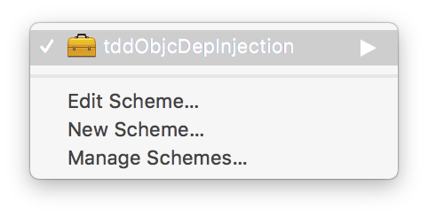
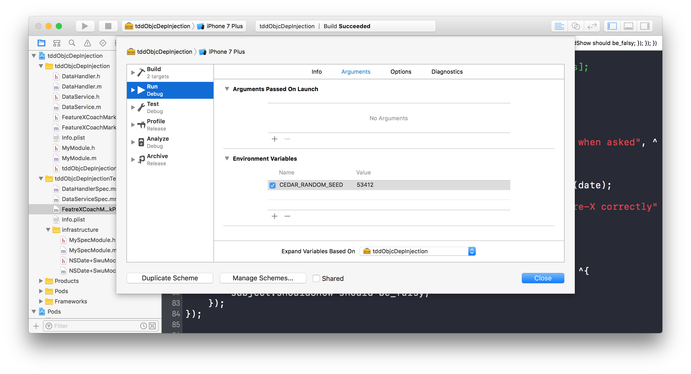

# tdd-objc-dependency-injection

This guide aims to introduce basic concepts about dependency injection, and how it relates to easier to maintain/understood code.  Here's a high level breakdown of what's covered in this guide,

1. **Thinking from the perspective of input/ouput, and using tests to identify code smells.**  `DataHandler` shows an example where there is an unneeded dependency, and `FeatureXCoachMarkPolicy` shows an example where there are hidden dependencies.
2. **A firmer grasp on how test contamination erodes confidence.**  This is illustrated by non-deterministic tests caused by hidden dependencies.
3. **Using dependency injection to write clear, well-understood, robust code.**  Exampes of constructor injection, property injection are provided.  `DataService` also shows an example of how to proceed when global state is unavoidable.

These are points you should keep in mind as you work through the examples.

- [Setting Up](#setting-up)
- [A Few Notes](#a-few-notes)
- [Some Examples](#some-examples)
	- [Example 1:  `DataHandler`](#example-1-datahandler)
	- [Example 2:  `FeatureXCoachMarkPolicy`](#example-2-featurexcoachmarkpolicy)
	- [Example 3:  `DataService`](#example-3-dataservice)

## Setting Up

1. `pod install`, if you don't have cocoapods, try `$ sudo gem install cocoapods` or visit the [CocoaPods getting started site](https://guides.cocoapods.org/using/getting-started.html)
2. open `tddObjcDepInjection.xcworkspace`
3. Hit `⌘`+`U` to run the tests.  You should see something like,
```
Finished in 0.0052 seconds

0 examples, 0 failures
Test Suite 'All tests' passed at 2017-05-19 11:15:06.507.
	 Executed 0 tests, with 0 failures (0 unexpected) in 0.000 (0.025) seconds
```

and voila!  You're good to go!

## A Few Notes

- When working through the examples, you can exclude a test by attaching a `x` in front of a `describe`, `context`, or `it`.
- To focus on running specific tests, attach a `f` in front.

When working through these examples, be sure to try changing things here and there to compare various outcomes.  This will help you develop an intuition for test contamination, how it happens, and what it reveals about the code.

## Some Examples

### Example #1: `DataHandler`

`DataHandler` provides a simple data handler method that returns an error if the supplied data is `nil`. 

1. Open `DataHandlerSpec` and remove `x` from the first set of tests.
2. Hit `⌘`+`U` to run the tests.  Notice that the 2nd assertion fails.
3. Take a look at the spec and the code, is there anything wrong?
4. Switch the order of two `it`'s and run tests again.  The tests ... pass??

wait...**What's going on?**

- Why did this happen?
- Try running the other tests in the spec, what do you notice?
- What's the code smell?

Writing tests, and especially thinking _test first_ (even if you don't test drive) has the effect of forcing you to think about code  design & architecture.  Code smells have a way of naturally manifesting themselves during testing.  In this case, testing forces us to think about the trade-off between `stateful + mutable` and `functional + immutable`.

### Example #2: `FeatureXCoachMarkPolicy`

You've probably seen a feature coachmark before.  It's usually an overlay or dummy-UI that help users discover features i.e. 'coach' user behaviour.  `FeatureXCoachMarkPolicy` is a policy object that determines when the coachmark should show up.

1. Reset your iPhone simulator
2. Open `FeatureXCoachMarkPolicySpec` and remove `x` from the first set of tests.
3. Run the tests.  Notice that all tests pass.
4. Run the tests again.  Notice that the first test fails.  Try repeating the steps, and try running tests multiple times (are you able to repro this behaviour?),

...**huh?**

- Why did this happen?
- Is the test/code incorrect?  If not, what's the issue?
- What would happen if this project was connectd to CI?
- What tends to happen to tests that behave this way?

Close inspection of the code will reveal that all the logic is correct, so it looks like we've escaped the fire this time.  When running on CI, since the test will pass at least once, it would not cause intermittent failures.

Consider an opposite scenario such as a _rate-app_ feature where instead of "hide-upon-interaction", the behaviour is "show-upon-interaction".  In this case, the hidden global-state-dependency might rightly cause the test to fail on first run, but pass on all subsequent runs.  While CI might catch this, locally, you might be unaware of a bug in your code!

Over time, tests that fail intermittently tend to be excluded or deleted, especially once complexity surrounding hte failing component grows.  It gradually produces a culture of _'oh just run it again, maybe it'll pass this time'_, _'maybe it's one of those tests that fail randomly, maybe we can x it out and worry about it later'_.  It's a slippery slope that erodes confidence and leads to tests being treated as a 2nd class citizen.

### `Pause`

Before we continue, click on the toolbox symbol that says `tddObjcDepInjection` in the top tool bar and hit _edit scheme_.




Delete the cedar seed environment variable, click _close_, and try running examples (1) and (2) again.  Do this a few times and you should notice some non-deterministic behaviour in example (1).  Test contamination in:  (1) is caused by outcomes being carried between tests; (2) is caused by reference to global state.

Add `53412` for `CEDAR_RANDOM_SEED` back to environment variables.  Cedar randomizes the run of tests to help you detect contamination.  Setting a specific seed is useful for hunting down the origin of contaminants.

### Example #3: `DataService`

`DataService` is part of a common app architecture where a service aggregates either network or cached data for multiple API's and returns it for consumption by the presentation layer.

1. Remove the `x` from all tests in this file.
2. Run the tests.  Notice that they all pass.
3. Compare the 3 sets of tests,
	- How do the `beforeEach` sections differ?
	- Which one do you find easiest to understand?
4. Try directly returning `NO` for the method `lastUpdateLessThan5DaysAgo`, which tests fail?  What does this say about the first set of tests?

A large part of testing is the concept of **living documentation**.  That is, dependencies and object graphs should be easily understood.  If you've never been in a code base, reading a test should help you understand the input/outputs, and clear intentions surrounding acceptable behaviour.  Doing dependency injection well means **clearly and precisely specifying requirements** as opposed to **obfuscating or underspecifying state/behaviour**.

